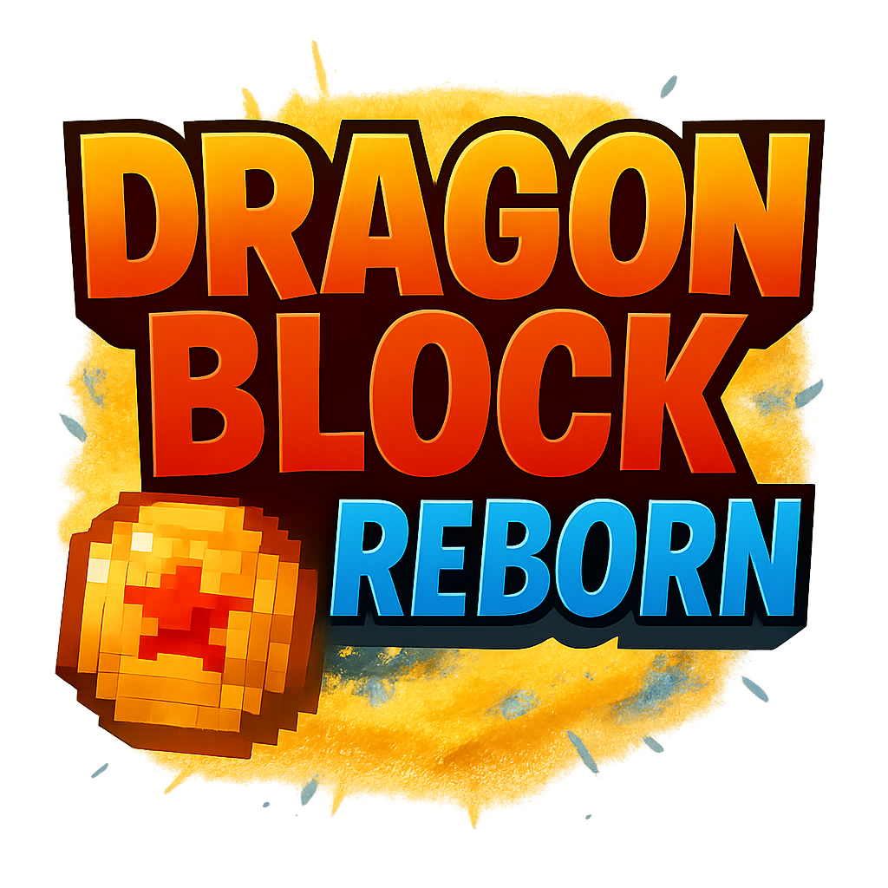

# Dragon-Block-Reborn  for Minecraft 1.21.11 #

Minecraft Mod based on Goku's adventures

## 📦 CI/CD Status

---

## 🔧 Requisitos

- Java 17 ou superior (utilizamos Java 21 no CI)
- Gradle (wrapper incluso no projeto)
- Minecraft Forge ou NeoForge
- IntelliJ ou VSCode para desenvolvimento

---

## Versions

<!--version-info-start-->

- **Minecraft Version:** 1.21.11
- **NeoForge Version:** 21.11.38-beta

<!--version-info-end-->

---

## 📚 Javadoc

The documentation is available hire:

🔗 [Access to Javadoc](https://rgerva.github.io/Dragon-Block-Reborn/)

> Auto updated by GitHub Actions on every push on branch `master`.
